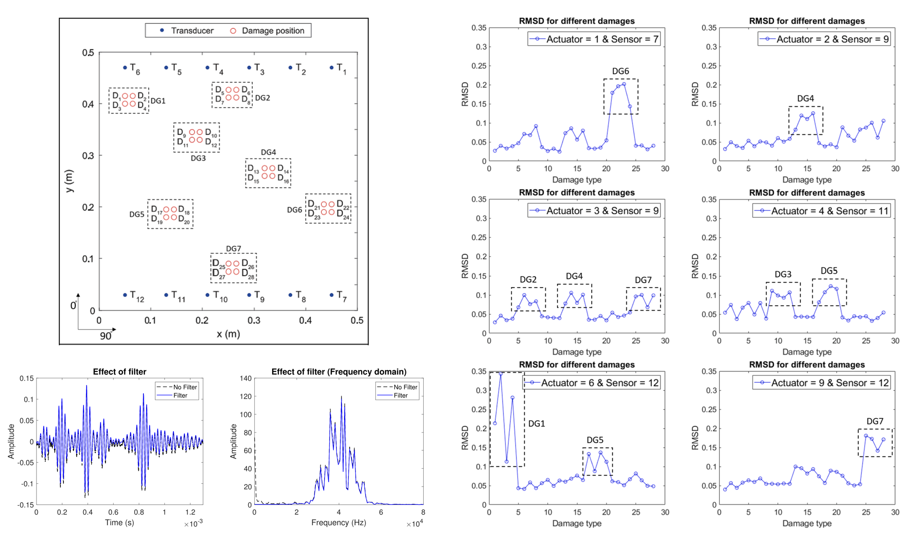

# PKaML for SHM
* Physical knowledge assisted Machine Learning is basically Domain Knowledge based data augmentation which helps ML models to encode better representation and train more efficiently.
* In guided wave-based SHM (GWSHM) of composite structures, directional dependent wave velocities, multiple and superimposed modes, mode-dispersion, mode-coupling, boundary reflections, unfiltered and noisy responses and additional frequency-dependent scattering due to damage makes dataset complicated difficult to handle directly using deep learning methods.
* For GWSHM, we have used domain knowledge of (a) digital band-pass filter design and visualization, (b) cross-statistical feature engineering, (c) channel and frequency preferencing, (d) physics of ultrasonic guided wave propagation and Time Of Flight (TOF) based signal windowing, (e) signal augmentation with noise to preprocess the dataset before feeding into a network.  

<p align="center">
  
</p>

-------
#### This repository contains codes accompanying the [paper](https://www.sciencedirect.com/science/article/abs/pii/S0041624X2100086X) "Combined two-level damage identification strategy using ultrasonic guided waves and physical knowledge assisted machine learning". The dataset accompying the paper is available [here](https://openguidedwaves.de/downloads/).
Please cite the paper if you are using the code, datasets or paper for your research paper. 
```
@article{rautela2021combined,
  title={Combined two-level damage identification strategy using ultrasonic guided waves and physical knowledge assisted machine learning},
  author={Rautela, Mahindra and Senthilnath, J and Moll, Jochen and Gopalakrishnan, Srinivasan},
  journal={Ultrasonics},
  volume={115},
  pages={106451},
  year={2021},
  publisher={Elsevier}
}
```

------------
Basic Details:
* The code is made on Python programming language on Jupyter notebook using Tensorflow 2.0.0
* Each line of code is provided with the heading and neccessary descriptions.
* To access the code on google colab, you need to put the dataset in the google drive. 
* For more information, you can write to me at my email id given in the paper.
* To get the datasets mentioned in the codes, send an email to me.

Main Details:
* There are 2 files in the main directory.
* One file is for damage detection and another one is for damage localization
